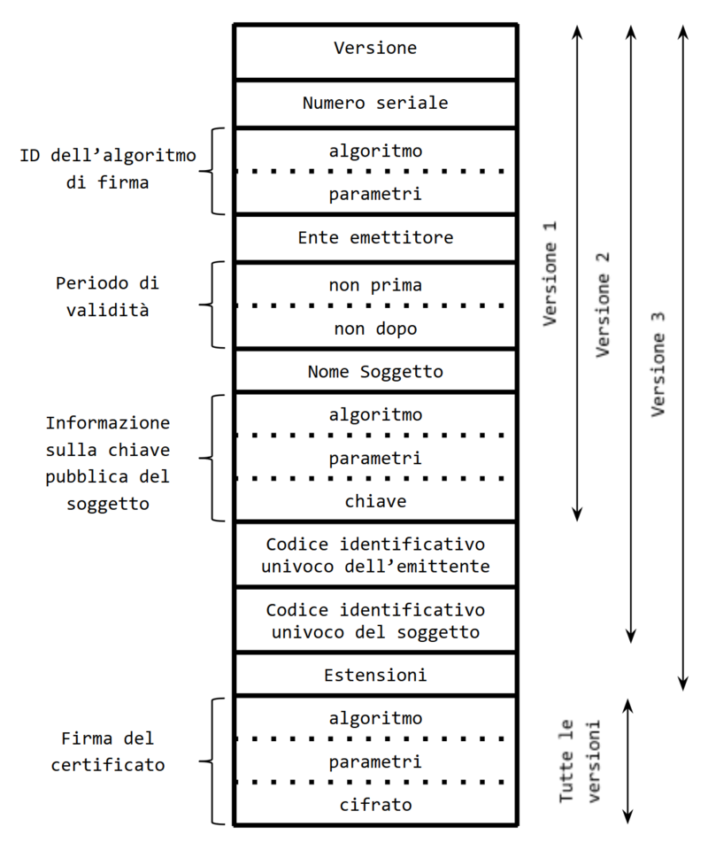

# Autenticazione e Integrità

> ## Protocollo crittografico
>
> - Successione di operazioni
> - Per due o più partecipanti
> - Per ottenere uno o più obiettivi:
>   - Segretezza
>   - Integrità
>   - Autenticazione
>   - Non ripudio
>
> Attacchi:
> - Al protocollo
> - All'algoritmo implementato
> - Passivi
> - Attivi
>
> Possibili attacchi:
> - IP spoofing: utilizzo dell'indirizzo IP di un'altro dispositivo
> - Lettura delle password in chiaro e loro utilizzo
> - Replica dei messaggi (lettura e riutilizzo)
> - Man-in-the-middle
> - Hijacking

## Protocolli di autenticazione

### A chiave simmetrica

(<code>KAB</code> deve essere precedentemente concordata)

- A -> B: "Sono A"
- B -> A: `R` (nonce)
- A -> B: <code>KAB(R)</code>

### A chiave asimmetrica

- A -> B: "Sono A"
- B -> A: `R` (nonce)
- A -> B: <code>dA(R)</code>
- opzionale:
  - B -> A: "<code>eA</code>?"
  - A -> B: <code>eA</code>

**Questo protocollo non è sicuro se non sono sicuro che <code>eA</code> sia veramente la chiave pubblica di A**  
Per questo motivo è anche possibile un attacco Man-in-the-middle con l'autenticazione di due comunicazioni A-T e T-B, di questo A e B non si accorgerebbero

### Autenticazione basata su crittografia

Sarebbe pertanto necessario un meccanismo di **distribuzione sicura delle chiavi**:
- Chiave simmetrica: intermediario di fiducia, **Key Distribution Center**
- Chiave asimmetrica: **Certification Authority** che garantisca l'autenticità delle chiavi pubbliche

## Key Distribution Center

Funzionamento:
- Un utente si registra presso il KDC
- L'utente ottiene una chiave per comunicare con il KDC
- Il KDC fornisce chiavi di sessione

Nel caso in cui Alice voglia comunicare con Bob:
- A -> KDC: <code>KA-KDC("Alice", "Bob")</code>
- KDC -> A: <code>KA-KDC(R)</code>, <code>KB-KDC("Alice", R)</code>
- A -> B: <code>KB-KDC("Alice", R)</code>
- B -> A: `R(...)`

## Certification Authority

E' un ente terzo che garantisce la corrispondenza soggetto <-> chiave pubblica  
Dopo aver verificato l'identità del soggetto la CA rilascia un certificato che lo lega alla sua chiave pubblica, il certificato è firmato dalla CA

Compiti fondamentali:
- Identificare il firmatario
- Garantire l'unicità delle firme
- Mantenere un registro dei possessori delle chiavi
- Gestire la scadenza e revocazione delle chiavi

### Certificato digitale

Contiene:
- I dati del soggetto
- Numero di serie del certificato
- Periodo di validità del certificato
- Nome e firma digitale della CA emittente
- Periodo di validità della chiave pubblica
- Chiave pubblica del possessore
- Opzionalmente l'indirizzo web ed il nome della compagnia proprietaria del server

## Integrità

Un messaggio integro non è stato modificato da terzi  
La segretezza comporta integrità

Problema della crittografia asimmetrica: tempi di cifratura e decifratura troppo lunghi  
Soluzione: **cifratura del digest, risultato di una funzione di hash**

Quindi si invia insieme al messaggio il digest cifrato con la chiave privata del mittente, il destinatario riceve il messaggio, calcola il digest e lo confronta con quello ricevuto, decifrandolo con la chiave pubblica del mittente

**Questo costituisce una firma digitale**

### Funzioni crittografiche di hash

Sono funzioni matematiche che restituiscono un output di lunghezza fisso univoco  
Sono irreversibili, non è possibile ricostruire `p` da `H(p)`  
E' possibile che due input restituiscano lo **stesso output**, tuttavia questi due input saranno **estremamente diversi** fra loro, anche in lunghezza, si dice che **i due input collidono**

Un attacco ad una funzione di hash consiste nel trovare due input che producono lo stesso digest, si può rendere la funzione più sicura aumentando la lunghezza del digest

## Firma digitale

Caratteristiche di una firma:
- Autenticità (identifica il firmatario)
- Integrità (non falsificabile)
- Non riutilizzabilità
- Immodificabilità
- Vincolante

La firma digitale è un protocollo crittografico, generalmente basato su algoritmi a chiave asimmetrica, constituito da due parti fondamentali:
- **Procedura di firma**: `sign(p)`
- **Procedura di verifica**: `verify(sign(p))`

Tale protocollo costituisce una firma poiché possiede le seguenti caratteristiche:
- Autenticità (la chiave privata è conosciuta solo dal firmatario)
- Integrità (chiunque può verificarla)
- Non riutilizzabilità (è legata al contenuto del documento)
- Immodificabilità (se il documento viene modificato la firma non è più valida)
- E' vincolante (non può essere ripudiata)

La sicurezza di una firma digitale è di gran lunga superiore di quella manuale, ed è definita **firma forte**

Viene solitamente creata mediante un dispositivo con elevate caratteristiche di sicurezza

## Firma elettronica

E' realizzabile attraverso vari strumenti, tra cui:
- Scansione della firma autografa
- Password o PIN
- Tecniche biometriche
- Firma digitale

## Modelli fiduciari e PKI

La verifica delle firme avviene utilizzando le chiavi pubbliche dei firmatari, ma:
- Dove si trovano?
- Chi garantisce l'identità del firmatario e l'associazione con la chiave?
- Se la chiave viene violata, cosa succede?

Per la gestione di questi problemi vengono definite delle policy di sicurezza che determinano:
- Come vengono generate le coppie di chiavi
- Dove vengono salvate
- Quanto tempo sono valide
- Cosa succede se una chiave è compromessa
- ...

### Direct Trust

Il soggetto stesso certifica l'autenticità della sua chiave pubblica

Vantaggi:
- Non è necessaria alcuna infrastruttura

Svantaggi:
- Occorre consegnare la chiave ai singoli soggetti
- Non è possibile il non ripudio di una firma
- Manca un'ente che applichi una policy di sicurezza

### Web of Trust

Il soggetto fa firmare il suo certificato da altri soggetti e viceversa

Vantaggi:
- Basta un'infrastruttura minima

Svantaggi:
- Bloccare una chiave è difficile
- Il non ripudio di una firma è possibile ma giuridicamente discutibile
- Una policy di sicurezza è difficilmente applicabile

### Hierarchical Trust (Public Key Infrastructure)

Prevede un ente al vertice di una gerarchia di **Certification Authority** (CA radice):
- La CA radice firma i certificati delle altre CA
- Ogni CA emette e firma certificati
- Se un soggetto si fida della CA radice si fida della sua firma, quindi anche della CA sottoposta e di tutti i certificati da lei firmati
- Un certificato si verifica risalendo tutte le firme fino alla CA radice

Vantaggi:
- L'unica chiave che deve essere nota è quella della CA radice, che serve a verificare tutti i certificati
- E' molto facile bloccare una chiave compromessa
- Una firma non può essere ripudiata
- Viene applicata una policy di sicurezza definita dalla CA radice e tutte le CA sottoposte applicano policy concordate con la CA radice che firma i loro certificati

Svantaggi:
- E' necessaria la creazione e la gestione di un'infrastruttura complessa
- Ogni partecipante deve registrarsi presso una CA per ottenere un certificato
- Ogni CA deve diffondere le chiavi pubbliche, gestire le chiavi bloccate, ...

PKI:
- insieme di processi e componenti teconologici
- che permettonol'impiego sicuro di sistemi di crittografia asimmetrica e dei relativi protocolli crittografici
- con l'uso del modello fiduciario gerarchico

Componenti:
- **Certification Authority**: crea certificati, deve operare in ambienti molto sicuri
- **Registration Authority**: può essere anche fisicamente separata dalla CA, identifica e registra i soggetti
- **Validation Authority**: verifica un certificato e ne conferma la validità

Componenti ulteriori:
- Local Registration Authority
- Revocation Authoriy
- Personal Security Environment

## Standard X.509

Definisce:
- Il formato dei certificati a chiave pubblica
- Il funzionamento delle CA

E' uno degli standard più importanti e ampiamente diffusi

## Marca temporale

E' un riferimento temporale opponibile a terzi, è un'ulteriore firma digitale apposta ad un documento associata ad una data e ora

E' un servizio che consiste in una firma digitale apposta da una Time Stamping Authority (solitamente una CA) al documento + data e ora sincronizzate con l'INRIM

Vantaggi:
- Praticità
- Risparmio economico e di tempo
- Validità legale
- Validità europea