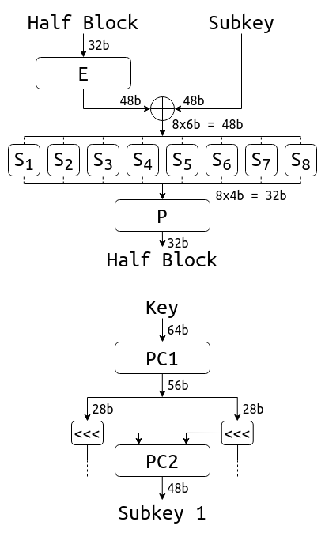
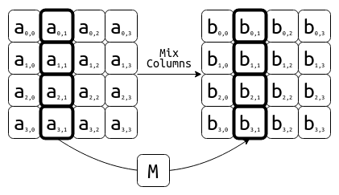
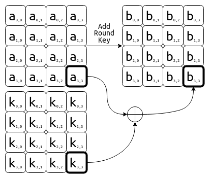

# Crittografia Simmetrica

## Sicurezza informatica

> Misure di carattere informativo, tecnologico ed organizzativo tese ad assicurare a ciascun utente e nessun altro i soli servizi previsti

> Protezione di informazioni e risorse ad accessi non autorizzati

Insieme di:
- **Riservatezza o Segretezza**: il contenuto del messaggio dovrebbe poter essere letto soltanto dagli autorizzati, segretezza anche del fatto stesso che la comunicazione sia avvenuta
- **Integrità**: il destinatario deve potersi accorgere di modifiche del messaggio
- **Autenticità o Autenticazione**: verifica dell'identità del mittente e del destinatario tramite l'acquisizione di dati che identificano univocamente un soggetto:
  - Qualcosa che si sa: password
  - Qualcosa che si ha: badge
  - Qualcosa che si è: impronta digitale
- **Disponibilità** del servizio

## Crittografia

Permette di ottenere la sicurezza delle informazioni  
Insieme alla crittoanalisi è una branca della crittologia  
Permette di ottenere:
- **Segretezza**
- **Integrità**
- **Autenticazione**
- **Non ripudio**

### Cifratura / Encryption

Plain Text + Encryption Algorithm + Key = Cypher Text  
Testo in chiaro + Algoritmo di cifratura + Chiave = Testo cifrato

### Decifratura / Decryption

Cypher Text + Encryption Algorithm + Key = Plain Text  
Testo cifrato + Algoritmo di cifratura + Chiave = Testo in chiaro

### Principio di Kerckhoffs

Un sistema crittografico deve essere sicuro anche se un attaccante dovesse conoscere tutti i dettagli del sistema tranne la chiave segreta

### Chiavi

- **Algoritmi a chiave simmetrica**: la stessa chiave è utilizzata per cifrare e decifrare  
  - La chiave deve essere scambiata in modo sicuro
  - Utilizzano funzioni matematiche molto semplici e molto efficienti
- **Algoritmi a chiave asimmetrica**: un paio di chiavi è generato, una si utilizza per la cifratura e l'altra per la decifratura:
  - Cifratura con chiave pubblica: segretezza
  - Cifratura con chiave privata: autenticazione

## Cifrari a trasposizione

Le lettere del messaggio non vengono sostituite ma ne viene alterata la posizione:
- Il testo cifrato è una permutazione del testo in chiaro
- La chiave è la permutazione stessa
- Un attacco esaustivo dovrebbe esplorare fino a `n!` permutazioni, con `n` il numero di caratteri

### Scitala lacedemonica

Su un nastro srotolato le lettere venivano trasposte in modo tale che solo l’adozione di un bastone identico (chiave) a quello usato per la scrittura del messaggio consentiva di ricostruire la posizione originaria delle lettere  
Caso particolare del cifrario Rail-Fence

### Cifrario Rail-Fence

Il testo in chiaro viene scritto in sequenze diagonali e viene letto per le linee orizzontali

`ciaoatutti` -> `caautiotti`  
`c-a-a-u-t-`  
`-i-o-t-t-i`

### Cifrario Route

Il testo in chiaro viene scritto per righe in una tabella (matrice), le cui dimensioni sono la chiave, e letto per colonne

`ciaoatutti` -> `catittauiotx`  
`ciao`  
`atut`  
`ttix`

La complessità potrebbe essere aumentata aggiungendo un'ulteriore cifratura con una tabella di dimensione diversa o permutando le colonne

## Cifrari a sostituzione (a chiave simmetrica)

Le lettere del messaggio in chiaro non vengono spostate ma sostutuite con altre lettere  
La sostituzione deve essere reversibile  
Per ogni elemento la chiave determina l'elemento che dev'essere usato per sostituirlo  
Massima sicurezza se len(key) >= len(message)  

Due tipologie di cifrari:
- Monoalfabetici: schema di sostituzione fisso
- Polialfabetici: schema di sostutuzione dipendente dalla posizione della lettera e/o dalle altre lettere del messaggio

### Cifrario di Cesare

Scorrimento fisso circolare dell'alfabeto  

<code>ek(pi) = Ci = (pi + k) mod 26</code>  
<code>dk(Ci) = pi = (Ci - k) mod 26</code>

Solo `26` possibili chiavi

### Cifrario di Cesare generalizzato

Ogni lettera viene sostituita con un'altra lettera, la chiave è la tabella di corrispondenza tra l'alfabeto in chiaro e l'alfabeto cifrato  
Ci sono `26!` possibili chiavi  
Attacco esaustivo praticamente impossibile  
Con la crittoanalisi statistica delle ricorrenze si può decifrare facilmente

> La crittoanalisi statistica analizza le frequenze con cui compaiono le lettere, in ogni lingua ogni lettera ha una frequenza caratteristica che non viene alterata dalla cifratura monoalfabetica

### Cifrario di Vigenère

La chiave viene ripetuta fino a raggiungere una lunghezza pari a quella del testo in chiaro  
Si utilizza una lettera del testo in chiaro (che seleziona la colonna) e la lettera corrispondente della chiave (che seleziona la riga) per trovare in carattere cifrato

Debolezze:
- Ripetizione della chiave: sequenze identiche di caratteri ad una certa distanza tra loro potrebbero corrispondere ad un multiplo della lunghezza della chiave
- Ogni volta che la chiave si ripete le lettere vengono cifrate con gli stessi cifrari monoalfabetici

> Test di Friedman o K-test stima la lunghezza della chiave

### Cifrario Playfair

Il testo viene diviso in digrammi  
La chiave viene scritta senza ripetizioni di lettere in una tabella 5x5 che viene poi rimpita con le lettere rimanenti  
Se il digramma contiene due lettere uguali si spezza e si riempie con una `x` o un carattere di riempimento  
Per ogni digramma:
- Se le due lettere si trovano sulla stessa riga: si sostituisce con la lettera a destra
- Se le due lettere si trovano sulla stessa colonna: si sostituisce con la lettera sotto
- Negli altri casi: si sostituisce con la lettera nella stessa riga che corrisponde alla colonna dell'altra lettera

Per decifrare la procedura si applica al contrario

Vantaggi:
- Ogni lettera può essere cifrata in modi diversi a seconda del digramma
- `25 x 24` possibili digrammi, attacco statistico più complesso

### Cifrario a rotori

Tecnica di cifratura polialfabetica che utilizza un certo numero di rotori, ciascuno dei quali collega casualmente 26 input con 26 output  
La posizione dei rotori cambia ogni volta che viene cifrata una lettera  
La sequenza di cifrari monoalfabetici si ripete solamente quando i rotori tornano alla posizione iniziale  
La cifratura finale dipende dalla posizione iniziale dei rotori e dai rotori scelti

La macchina Enigma:
- Utilizza 3 rotori, in seguito 3 di 5
- Ha un riflessore che fa si che si possa sia cifrare che decifrare nello stesso modo
- Utilizza anche una plugboard, che effettua una permutazione ed applica così un ulteriore cifrario monoalfabetico sia prima che dopo la cifratura/decifratura

### Cifrario di Vernam / One Time Pad

Basato su quello di Vigenère con chiave:
- di lunghezza almeno pari al testo in chiaro
- casuale
- non riutilizzata

Applicata ai dati binari la tavola di vigenère diventa:

|         | `0` | `1` |
|---------|-----|-----|
| **`0`** | `0` | `1` |
| **`1`** | `1` | `0` |

che corrisponde alla porta logica XOR:
- `C = p ⊕ k`
- `p = C ⊕ k`

Infatti `C ⊕ k = p ⊕ k ⊕ k` ma `k ⊕ k = 0` e `p ⊕ 0 = p`

Se la chiave viene riutilizzata lo XOR tra i testi in chiaro è uguale allo XOR tra i testi cifrati:

<code>C1 ⊕ C2 = p1 ⊕ k ⊕ p2 ⊕ k</code> ma `k ⊕ k = 0` e <code>p1 ⊕ p2 ⊕ 0 = p1 ⊕ p2</code>

Debolezza: è malleabile, è possibile alterare il testo cifrato in modo che il destinatario trovi il testo in chiaro desiderato, dato che è possibile trovare la chiave avendo il testo in chiaro e il testo cifrato, ciò non è possibile in tutti i cifrari

### Cifrari a flusso basati su OTP

I bit sono cifrati indipendentemente gli uni dagli altri  
Le sequenze di bit generate sono pseudo-aleatorie da meccanismi deterministici a partire da un seed, è sufficiente che appaiano aleatorie da un punto di vista statistico

Esempio di generatore pseudo-aleatorio: <code>Xn = (aXn-1 + c) mod m</code> dove <code>X0</code>, `a` e `c` costituiscono il seed, mentre `m` è solitamente noto

La chiave è quindi in realtà il seed, con il quale il Pseudo-Random Generator genera la sequenza di bit che viene messa in XOR con il plaintext

### Cifrari a blocchi

Raggruppano i bit in blocchi di `k` bit che possono essere permutati in <code>2k!</code> modi possibili, la tabella di codifica è la chiave e deve essere biunivoca (o invertibile)

### Confusione e diffusione

Shannon in "Communication Theory od Secrecy Systems" afferma che un buon algoritmo di cifratura per essere robusto ad attacchi di tipo statistico deve possedere le seguenti caratteristiche:
- **Confusione**: un attaccante non deve poter trovare la chiave anche avendo a disposizione un grande numero di coppie plaintext-cyphertext -> ogni bit del testo cifrato deve dipendere da tutti i bit della chiave
- **Diffusione**: un attaccante non deve poter identificare "anomalie statistiche" che esistono nel testo in chiaro -> ogni bit modificato del testo in chiaro deve modificare il maggior numero di bit del testo cifrato in modo da non mostrare possibili pattern

Queste due proprietà messe insieme sono conosciute come **Avanlanche Criterion** o **Effetto a Valanga**

**Strict Avalanche Criterion**: se un bit del plaintext viene complementato allora ogni bit del cyphertext ha una probabilità del 50% di essere complementato

### Substitution-Permutation Networks

Algoritmi composti da sequenze di operazioni matematiche a cascata con lo scopo di massimizzare confusione e diffusione  
Composte da **S-Box** e **P-Box** usati in maniera alternata e iterata più volte  
Ogni iterazione si chiama **round** o **stadio**

Affinchè sia poi possibile decifrare, le S-Box devono essere invertibili, ovvero biunivoche

### Reti di Feistel

Casi speciali di SPN, dove la funzione F è una S-Box e lo scambio di R e L è una P-Box

La funzione F prende in input la sottochiave <code>Ki</code> e il semiblocco destro generando una specie di sottochiave che viene poi messa in XOR con il semiblocco sinistro, per questo non è necessario che sia invertibile e può essere anche molto complessa, infatti:  
<code>Rn-1 = [Ln ⊕ F(Kn, Rn)] ⊕ F(Kn, Rn) = Ln</code>  
quindi ripetendo lo stesso procedimento con `i` da `n` a `0` si decripta il messaggio

Per realizzare una rete di Feistel occorre scegliere:
- Dimensione dei blocchi (spesso 64bit)
- Dimensione della chiave (almeno 128bit)
- Numero di round (tipicamente 16)
- Algoritmo di generazione delle sottochiavi
- La funzione di Feistel

### Data Encryption Standard

Sviluppato da Feistel, è una rete di Feistel con:
- Blocchi da 64bit
- Chiave di 64bit: 56bit + 8bit di checksum
- Il generatore di sottochiavi ne genera una da 48bit per ogni round
- Fase di permutazione iniziale e finale
- 16 stadi

### Triple DES

Abbreviato TDES o 3DES migliora significativamente la sicurezza del DES ed è ritenuto ancora sicuro  
Utilizza blocchi di 64bit, tre cifrature consecutive con tre chiavi di 56bit che corrispondono ad una chiave di 168bit

**EEE Schema**:
<code>C = DES(k3, DES(k2, DES(k1, p)))</code>  
**EDE Schema** (standard):
<code>C = DES(k3, DES-1(k2, DES(k1, p)))</code>

**Utilizzo delle chiavi**:
- <code>k1 ≠ k2</code>, <code>k2 ≠ k3</code> e <code>k1 ≠ k3</code>: sicurezza di 168bit (56 x 3)
- <code>k1 = k3 ≠ k2</code>: sicurezza di 112bit (56 x 2)
- <code>k1 = k2 = k3</code>: sicurezza di 56bit, compatibile con il DES

### Advanced Encryption Standard

Basato su sostituzioni e permutazioni come le SPN, ma non è una rete di Feistel  
Blocchi di 128bit, chiave da 128/192/256bit, 9/11/13 stadi  
I blocchi di input vengono organizzati in 4x4byte

Trasformazioni effettuate ad ogni stadio:
- **Substitute Bytes**:  
  
- **Shift Rows**:  
  
- **Mix Columns**:  
  
- **Add Round Key**:  
  

Tranne Add Round Key, le trasformazioni per la decifratura sono diverse

**Modalità operative**:
- **Electronic CodeBook**: Ogni blocco viene cifrato in modo indipendente dagli altri, blocchi in chiaro uguali portano a blocchi cifrati uguali  
  
- **Cipher Block Chaining**: Ogni blocco prima di essere cifrato viene messo in XOR con il blocco cifrato precedente, per il primo viene utilizzato un Initialization Vector, cifratura sequenziale, decifratura parallela  
  
- **Counter (CTR)**: Viene cifrata una composizione matematica di **nonce** e **counter** il cui risultato viene messo in XOR con il blocco in chiaro  
  