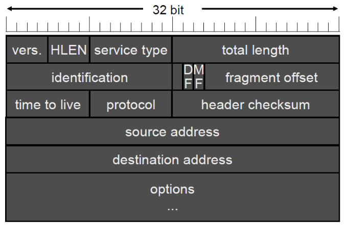
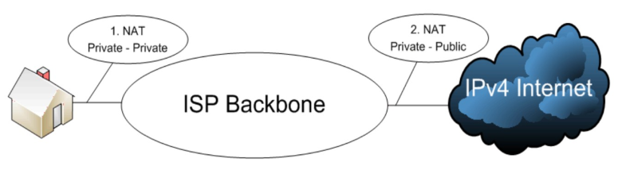
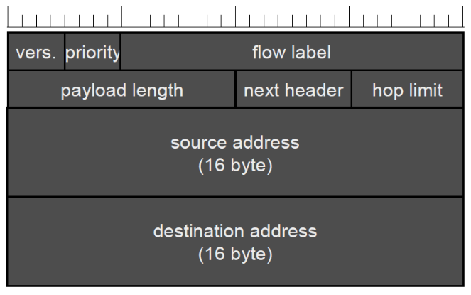
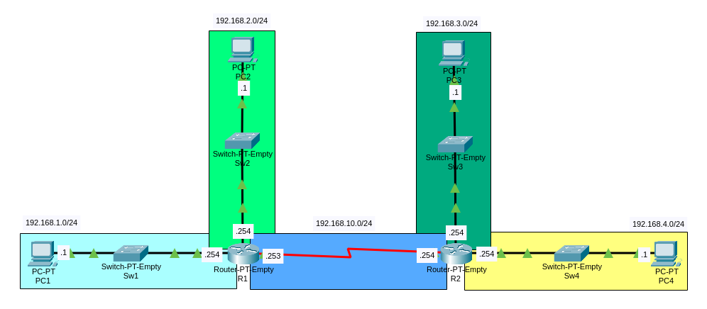

# Livello Network

# Internet Protocol

- Protocollo seplice di tipo **datagram**, **non connesso**
- Frammentazione e riassemblaggio
- Rilevazione degli errori dell'header, senza correzione
- Versioni conosciute e utilizzate:
  - 4, indirizzi a 32bit
  - 6, indirizzi a 128bit

# Internet Protocol version 4

Indirizzi a **32bit**, 4 byte nel **formato decimale 9.35.225.45**

### Header

- **HLEN**: Header Length, varia a seconda delle options, indica il numero di 32bit words che compongono l'header
- **Service Type**: Servizio desiderato in termini di velocità e affidabilità
- **Total Length**: HLEN + Payload Length
- **Identification**: utilizzato per riconoscere frammenti dello stesso datagram
- **Fragment Offset**: posizione del frammento, in unità di 8 byte
  - **Don't Fragment**
  - **More Fragments**
- **Time To Live** (TTL): Numero di router che può attraversare prima di essere scartato
- **Protocol**: Transported Protocol
- Options: funzionalità aggiuntive, ci sono se HLEN > 5

### Classes

- **A**  
  `0*******`, `255.0.0.0`, 1 -> 127  
  Privata `10.0.0.0`
- **B**  
  `10******`, `255.255.0.0`, 128 -> 191  
  Private `172.16.0.0` -> `172.31.0.0`
- **C**  
  `110*****`, `255.255.255.0`, 192 -> 223  
  Privata `192.168.0.0`
- Multicast  
  `1110****`, 224 -> 239
- Usi futuri  
  `1111****`, 240 -> 255

> RFC 1918: Indirizzi privati

### Indirizzi speciali

- **Questo host**: `0.0.0.0`
- **Host in questa rete**: campo di rete a `0` seguito dal campo host  
ad esempio nella rete `192.168.0.0/24` ci sono A(`.1`) e B(`.2`), A può mandare a B un messaggio con destinatario `0.0.0.2`
- **Broadcast su questa rete**: `255.255.255.255`
- **Broadcast su una rete remota**: campo di rete e campo host a `1`  
ad esempio nella rete `192.168.0.0/24` -> `192.168.0.255`
- **Loopback**: la rete `127.0.0.0/8`, solitamente `127.0.0.1`

### Subnetting

N bit più significativi del campo host identificano la subnet  
La netmask o subnetmask è un parametro che specifica il subnetting

Esempio: subnetting a maschera variabile per suddividere la rete `192.168.21.0/24` in 5 reti:
1. da 102 host
2. da 41 host
3. da 30 host
4. da 4 host
5. da 2 host

| Hosts | Rete/CIDR notation | Mask            | Primo ind. | Ultimo ind. | Broadcast |
|-------|--------------------|-----------------|------------|-------------|-----------|
| 126   | 192.168.21.0/25    | 255.255.255.128 | .1         | .126        | .127      |
| 62    | 192.168.21.128/26  | 255.255.255.192 | .129       | .192        | .191      |
| 30    | 192.168.21.192/27  | 255.255.255.224 | .193       | .222        | .223      |
| 6     | 192.168.21.224/29  | 255.255.255.248 | .225       | .230        | .231      |
| 2     | 192.168.21.232/30  | 255.255.255.252 | .233       | .234        | .235      |

### Frammentazione

Diverse LAN, diversi Maximum Transmission Unit, diversi protocolli (Ethernet, Wi-Fi, ...), limitazioni (hardware, software, standard) possono rendere necessario frammentare il pacchetto, la frammentazione puo essere:
- **Trasparente**:  
in ogni nodo viene controllata l'avvenuta ricezione di tutti i frammenti e si ricompone il pacchetto -> tutti i frammenti devono arrivare allo stesso nodo di uscita
- **Non trasparente**:  
Ogni host deve essere in grado di ricomporre il pacchetto  
L'overhead (ci sono tanti header per uno stesso pacchetto, uno per ogni frammento, che è a sua volta un pacchetto) viene mantenuto anche nei collegamenti che non richiederebbero la frammentazione  
I frammenti possono attraversare diversi nodi di uscita  
E' necessario un meccanismo di numerazione dei pacchetti ad albero, ma è complesso gestire le ritrasmissioni poichè possono attraversare reti diverse ed essere frammentati ulteriormente

## Address Resolution Protocol

Utilizzando la trasmissione broadcast delle LAN **risolve gli indirizzi MAC dei rispettivi IPv4**

1. Viene inviato in **broadcast di livello 2** (destinatario `FF-FF-FF-FF-FF-FF`) un pacchetto contenente l'indirizzo IPv4 di cui si cerca il corrispondente MAC -> **ARP Request**
2. Tutti gli host leggono il pacchetto, quello interessato **risponde con il proprio indirizzo MAC** -> **ARP Reply**

## Dynamic Host Configuration Protocol version 4

Parametri obbligatori:
- **Indirizzo IP** assegnato
- **Netmask**
- Indirizzo IP del **default-router**
- **Lease Time**, per quanto tempo il client può utilizzare l'indirizzo assegnato

Permette tre tipi di allocazione:
- **Statica**: manuale, ad ogni MAC viene sempre assegnato lo stesso IP
- **Automatica**: senza Lease Time
- **Dinamica**: con Lease Time

Richiesta di un indirizzo:
1. Il client invia un messaggio **DHCPDISCOVER** destinato alla **porta 67 di UDP**, **in broadcast a livello 3** (sorgente `0.0.0.0`, destinatario `255.255.255.255`) **e a livello 2** (destinatario `FF-FF-FF-FF-FF-FF`)
2. Il router inoltra il messaggio ad un server DHCP, che può essere lui stesso
3. Il server DHCP risponde con una **DHCPOFFER**
4. Il client risponde con una **DHCPREQUEST** per accettare i parametri proposti (il messaggio è normalmente inviato in broadcast in modo che altri server DHCP vengano informati che la loro offerta non è stata accettata)
5. Il server verifica con un ping che l'indirizzo sia ancora libero risponde con un **DHCPACK** con cui conferma la richiesta
6. Il client esegue un arp sull'indirizzo proposto, se rimane senza risposta inizia ad usare l'indirizzo

Rinnovo di un indirizzo:
1. Il client invia una **DHCPREQUEST al server che lo aveva assegnato**, se non riceve risposta invia una DHCPREQUEST in broadcast
2. Il server verifica le informazioni e invia un **DHCPACK**

> RFC 2131, 2132

### Automatic Private IP Addressing

Se un host non riesce ad ottenere in indirizzo IP usando DHCP allora ne genera uno randomicamente tra `169.254.1.0/16` e `169.254.254.255/16`, poi invia un ARP request per trovare il MAC dell'indirizzo ip generato, se rimane senza risposta allora inizia ad utilizzarlo

> RFC 3330

## Network Address Translation

Tipologie:
- **Static NAT**:  
Assegnazione fissa di un indirizzo pubblico ad ogni privato
- **Dynamic NAT**:  
Mappatura tra un pool di indirizzi pubblici con un pool di indirizzi privati più ampio
- **Port Address Translation**:  
Viene assegnato un indirizzo pubblico a tutti gli indirizzi privati, che vengono quindi distinti tramite il numero di porta mittente

> Carrier NAT: il NAT è utilizzato più volte
> 

> RFC 1631, 2663

# Internet Protocol version 6

Anche chiamato IPnG, IP next Generation  
Indirizzi a **128bit**, **16 byte nel formato esadecimale `fe80:0000:0000:0000:0000:0000:0000:0001`**, che può essere abbreviato come `fe80::1`
Connectionless  
TTL -> hop count  
**Subnetmask** -> **Classless Inter-Domain Routing** notation per la lunghezza del prefisso 
Niente NAT, non c'è la necessità  
E' possibile assegnare più di un indirizzo (anche pubblico) ad una scheda di rete  
L'header non ha più un campo options variabile, è però possibile concatenare più headers  
Unifica Internet e Intranet in quanto ogni dispositivo ha un indirizzo pubblico  

Problemi di IPv4:
- Spazio di indirizzamento troppo ridotto
- Utilizzo di indirizzamento privato e del NAT
- Fate sharing, ogni errore o problema di sicurezza di un dispositivo nella rete interna riguarda anche tutti gli altri
- Non è specificato il tipo di servizio per i dati multimediali
- Manca il supporto per il lavoro di gruppo distribuito
- Ogni modifica per risparmiare indirizzi è difficile e costosa

### Header

- **Priority**: 0-7 per comunicazione normale, 8-15 per audio/video
- Flow Label: identifica flussi IP per ottenere dalla rete garanzie di servizio tipiche dei circuiti virtuali
- **Payload Length**: lunghezza del payload
- **Next Header**: per concatenare più headers, tipo del prossimo header
- **Hop Limit**: limite di router che il pacchetto può attraversare

### Tipi di indirizzi IPv6

- **Link Local Address**:  
`fe80::/10` -> `1111 1110 10**`  
Valido soltanto all'interno di una rete fisica
- **Site Local Address**:  
`fec0::/10` -> `1111 1110 11**`  
Indirizzo privato deprecato
- **Unique Local Address**:  
`fc00::/7` -> `1111 110*`  
Indirizzo privato, valido soltanto nelle reti locali
  - `fc00::/8` -> `1111 1100`
  Soggetto a registrazione
  - `fd00::/8` -> `1111 1101`
  Utilizzabile localmente
> - **Documentation**:  
> `2001:db8::/32` RFC 3849
- **Multicas Address**:  
`ff00::/8` -> `1111 1111`
  - `ff01::1/128` All nodes
  - `ff01::2/128` All routers
  - `ff02::/16` -> `1111 1111 0000 0010` Link Local Multicast
- IPv4 embedded o mapped, deprecati, composti da 96bit fissi e dall'indirizzo IPv4
- Tunneling 4in6, permette di trasmettere pacchetti IPv4 attraverso reti IPv6 only, codificando gli indirizzi, ad esempio `192.168.1.1/5` diventa `2002:c0a8:0101:5::1`
- **Loopback** o localhost **Address**:  
`::1/128`
- **Unspecified Address**:  
`::/128` o `::/0`

### Struttura degli indirizzi IPv6

1. **Site ID -> 48bit**
2. **Subnet -> 8bit**
3. **Host -> 64bit**

### Best Practice

(Esempio con `2001:db8:1::/48`)
1. 4 blocchi /56 per l'infrastruttura di rete (`2001:db8:1::/56` -> `2001:db8:1:300::/56`)
2. 12 blocchi liberi (`2001:db8:1:400::/56` -> `2001:db8:1:f00::/56`)
3. 4 blocchi per le DMZ (`2001:db8:1:1000::/56` -> `2001:db8:1:1300::/56`)
4. 12 blocchi liberi (`2001:db8:1:1400::/56` -> `2001:db8:1:1f00::/56`)
5. 4 blocchi per il primo edificio (`2001:db8:1:2000::/56` -> `2001:db8:1:2300::/56`)
6. ...

## Neighbor Discovery Protocol

Neighbor Discovery utilizza messaggi ICMPv6:
1. **Neighbor Solicitation** inviato da un host che necessita di conoscere l'indirizzo MAC del corrispondente IPv6
2. **Neighbor Advertisement** in risposta ad un Neighbor Discovery dall'host con quell'indirizzo IPv6 

### StateLess Address AutoConfiguration

1. **Router Solicitation** con destinatario all routers
2. **Router Advertisement** (inviati anche periodicamente dal router): fornisce il **default-gateway** (il router stesso) e il **prefisso di rete Global Unique** e esplicita se e come deve essere cercato un server DHCPv6

## Dynamic Host Configuration Protocol version 6

- **Stateless**:  
Il server DHCPv6 fornisce soltanto gli indirizzi dei server DNS (solitamente ce ne sono due: primary e secondary), time-server, ecc.
- **Stateful**:  
L'host richiede un indirizzo IPv6 che viene memorizzato in aggiunta a quelli autogenerati, questo indirizzo viene memorizzato dal server DHCPv6 che invia anche le informazioni fornite in modalità stateless

# Internet Control Message Protocol

IP è un protocollo best-effort, ma la suite TCP/IP fornisce messaggi informativi e di errore, il cui scopo non è di renderlo affidabile, ma di fornire feedback sui problemi e strumenti di dignostica

## Header

- **Type**: Error or Information
- **Code**: Code or Information Type

## Messaggi ICMP
I messaggi ICMP possono essere di diversi tipi:
- Host Reachability:  
Testa la raggiungibilità di un host, tramite **ping** l'host invia un **echo request**, se il destinatario è raggiungibile ricevera da lui una **echo reply**
- Destination or Service unreachable:  
Utilizzato da host o gateway quando ricevono un pacchetto che non possono consegnare
- **Time Exceeded**:  
Inviato dai router quando il TTL o Hop Limit è `0`

# Routing

Il routing è il processo di identificazione del percorso migliore, route, verso una destinazione

## Routing Table

Tutti i dispositivi che operano a livello 3 dispongono di **tabelle di routing** per decidere a chi inoltrare il pacchetto perchè questo possa raggiungere la sua destinazione

La tabella memorizza tre tipi di voci:
- **Directly Connected Routes**:  
Quando un'interfaccia viene configurata con un indirizzo ip e attivata viene aggiunta una di queste voci, ad esempio se a G0/0 viene assegnato l'indirizzo `192.168.15.254/24` il router aggiunge una voce `192.168.15.0/24` -> G0/0
- **Remote Routes**:  
Sono voci aggiunte manualmente da un amministratore di rete o automaticamente tramite un protocollo di routing dinamico, servono per intradare i pacchetti verso reti remote
- Default Route

### Best Match

Il **Best Match** è l'entrata della routing table che corrisponde meglio all'indirizzo di destinazione  
Es:  
Destinatario `192.168.10.5`  
Routing Table
| Route           | Interface |
|-----------------|-----------|
| 192.168.0.0/16  | G0/1      |
| 192.168.10.0/24 | G0/2      |

La seconda entrata è detta Best Match

### Last Resort o Default Route

Solitamente nelle tabelle di routing si include un **Last Resort**, un indirizzo che fa sempre match, in modo che se non viene trovata una route migliore il router invia il pacchetto ad un altro router che potrebbe sapere dove instradarlo  
Es:  
Destinatario `192.168.7.2`  
Routing Table  
| Route           | Interface |
|-----------------|-----------|
| 192.168.5.0/24  | G0/1      |
| 192.168.36.0/24 | G0/2      |
| 0.0.0.0/0       | G0/3      |

L'ultima entrata è la **Default Route**, in questo caso il pacchetto verrà inviato attraverso G0/3

### Supernetting

Per rendere le tabelle di routing più corte e quindi il processo di esplorazione più veloce è a volte possibile raggruppare reti con lo stesso **Next Hop** (o stessa interfaccia) in un'unica entrata  
Es:  

Routing Table di R1  
| Route             | Interfaccia/Next Hop  |
|-------------------|-----------------------|
| 192.168.0.0/16    | 192.168.10.254        |
| 192.168.1.0/24    | G1/0                  |
| 192.128.2.0/24    | G2/0                  |
| 192.168.10.254/24 | S0/0                  |

In questo caso è stato possibile raggruppare `192.168.3.0/24` e `192.168.4.0/24` in `192.168.0.0/16`

Possibili casi di pacchetti da PC1
- Verso PC3 o PC4:  
L'unico match è con `192.168.0.0/16` poichè applicando la netmask `/16` (`255.255.0.0`) a `192.168.3.1` o `192.168.4.1` si ottiene `192.168.0.0` -> match
- Verso PC2:
  - Un match è con `192.168.0.0/16` (come precedentemente descritto, con `192.168.2.1`)
  - Un altro match è con `192.168.2.0/24` perchè applicando la netmask `/24` (`255.255.255.0`) a `192.168.2.1` si ottiene `192.168.2.0`, ed è best match perchè `24` > `16`

In entrambi i casi i pacchetti verranno inviati correttamente