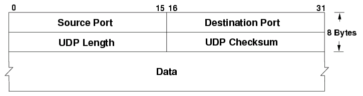

# Livello Transport

# Port number

E' l'indirizzo del livello di trasporto, identifica un processo  
E' un intero a 16bit, da 0 a 65535

| Porta       | Descrizione     |
|-------------|-----------------|
| 0-1023      | Well known      |
| 1024-49152  | Registered      |
| 49152-65535 | Dynamic/Private |

# User Datagram Protocol

Non affidabile, non connesso  
Trasmissione di tipo best effort

## Datagram

- **Header**
  - **Source Port**: numero porta porcesso sorgente
  - **Destination Port**: numero porta processo destinatario
  - **UDP Length**: lughezza totale del datagramma
  - **Chechsum**: codice di controllo del datagramma
- **Data**: payload

La dimensione massima è 64KiB (dimensione massima pacchetto IP) - 20B (dimensione minima header IP) - 8B (dimensione header UDP) = 65508B

## Vantaggi

- Non richiede di stabilire una connessione
- Overhead minimo

## UDP-Lite

E' nato dalla necessità di non scartare i datagammi UDP errati comunque utili per alcune applicazioni come il VoIP o streaming audio/video  
Il campo **UDP Length** diventa **Checksum Coverage Length** e indica per quanti byte del pacchetto viene calcolato il checksum  
Di conseguenza la lunghezza del datagramma viene calcolata da quella del pacchetto IP

# Transmission Control Protocol

Connesso e affidabile  
Consegna tutti i byte e nell'ordine corretto, si parla di flusso di byte  
Full-duplex, si può trasmettere e ricevere dati contemporaneamente, anche grazie alle due differenti sequenze di riscontro, viene considerata una coppia di comunicazioni simplex  
Supporta il controllo del flusso

## Datagram

- **Header**
  - **Source Port**: numero porta porcesso sorgente
  - **Destination Port**: numero porta processo destinatario
  - **Sequence Number**: numero di sequenza progressivo del primo byte di dati
  - **Acknowledgement Number**: ha significato solo se il flag ACK è impostato a 1, è il prossimo sequence number atteso
  - **Data Offset** o **TCP Header Length**: numero di 32bit word dell'header
  - **Flags**
    - **URG**: una parte o tutto il pacchetto contiene dati urgenti, è necessario leggere l'urgent pointer
    - **ACK**: il campo **Acknowledgement Number** contiene un numero di riscontro
    - **PSH**: indica che i dati in arrivo devono essere passati subito al livello superiore
    - **RST**: a volte utilizzato per la chiusura forzata della connessione
    - **SYN**: il **Sequence Number** è da utilizzare come Initial Sequence Number
    - **FIN**: utilizzato per la chiusura della connessione
  - **Window Size**: utilizzato per comunicare il numero massimo di byte che si possono ancora ricevere
  - **Checksum**: codice di controllo del datagramma
  - **Urgent Pointer**: indica il numero dell'ultimo byte urgente nel campo **Data**
  - **Options**: da 0 a 10 32bit word
    - **Selective Acknowledgement**: per indicare l'avvenuta di un range di datagrammi oltre a quelli confermati con l'Ack Number
- **Data**: payload

## Retransmission Time Out

Massimo intervallo di tempo che può intercorrere tra l'istante di trasmissione di un segmento e l'istante di ricezione del corrispondente riscontro prima che il mittente consideri perso il segmento

### Stima e impostazione

- Si misura il tempo intercorso tra la trasmissione di un segmento e la ricezione del suo Ack: **SampleRTT**
- Si calcola una media mobile esponenziale ponderata con `a = 0.125`: **EstimatedRTT = (1 - a) * EstimatedRTT + a * SampleRTT**
- Si calcola una deviazione standard: **DevRTT = (1 - b) * DevRTT + b * (SampleRTT - EstimatedRTT)**
- Si stabilisce quindi il timeout: **TimeoutInterval = EstimatedRTT + 4 * DevRTT**

## Keepalive timer

Viene resettato ogni volta che viene ricevuto un datagramma, quando scade la connessione viene dichiarata chiusa per eccessiva inattività  
Per evitare che questo timer scada inopportunamente il TCP invia datagrammi vuoti se il mittente non ha nulla da inviare

## Timed wait

Tempo che viene atteso prima di chiudere effettivamente una connessione, è pari al doppio del tempo di vita di un comune pacchetto

## Timer di persistenza

Timer che viene avviato quando il ricevente invia un datagramma di riapertura della finestra, che prima aveva impostato a 0, per evitare di rimanere in attesa nel caso il mittente non lo abbia ricevuto

## Congestion Window e Advertised Window

**Congestion Window**: Varia in base agli eventi che il mittente osserva  
**Advertised Window**: Dipende dalla disponibilità del buffer di ricezione  
Il rilevamento e il controllo della congestione viene delegato al TCP ed è di tipo end-to-end  
Il massimo della finestra di trasmissione si ottiene quindi con il minimo tra la Congestion Window e l'Advertised Window

## Three-way Handshake

Per apertura della connessione

- Client -> Server: Syn
- Server -> Client: Syn, Ack
- Client -> Server: Ack
- ...

## Sequence Number and Acknowledgement

Per conferma della ricezione dei datagrammi

- ...
- A -> B: Seq 100, Ack 500, 50B
- B -> A: Seq 500, Ack 150, 70B
- A -> B: Seq 150, Ack 570, 25B
- B -> A: Seq 570, Ack 175, 15B
- ...

## Four-way Handshake

Per chiusura della connessione

- ...
- Client -> Server: Fin
- Server -> Client: Ack
- ...
- Server -> Client: Fin
- Client -> Server: Ack

## Slow Start e Congestion Avoidance

La Congestion Window viene determinata in base allo **Slow Start Threshold**: se è minore si utilizza l'algoritmo **Slow Start** altrimenti viene utilizzato l'algoritmo **Congestion Avoidance**  
Se si verifica la perdita di un datagramma si ripete l'algoritmo da capo dopo aver impostato il valore di Threshold alla metà della Congestion Window

### Slow Start

Si procede raddoppiando la Congestion Window per ogni Ack ricevuto

### Congestion Avoidance

Si procede incrementando la Congestion Window di un Maximum Segment Size per ogni Ack ricevuto